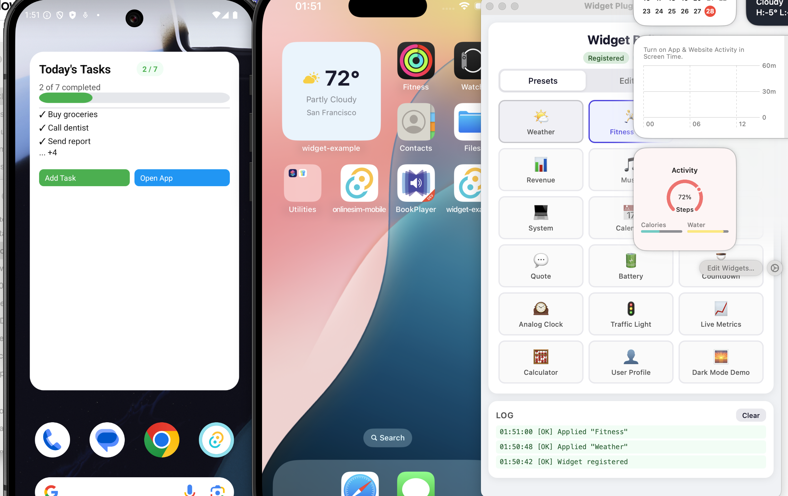

[](https://www.npmjs.com/package/tauri-plugin-widgets-api)
[](https://crates.io/crates/tauri-plugin-widgets)
[](https://docs.rs/tauri-plugin-widgets/)
[](https://github.com/s00d/tauri-plugin-widgets/issues)
[](https://github.com/s00d/tauri-plugin-widgets/stargazers)
[](https://www.donationalerts.com/r/s00d88)

# Tauri Plugin Widgets

A Tauri v2 plugin for building **native widgets** on Android, iOS and macOS, with desktop widget windows on Windows and Linux. Includes a **universal JSON-based UI generator** — send a single config from your Tauri app and the plugin renders it natively on every platform (SwiftUI on Apple, Jetpack Glance on Android, HTML on desktop).

[![Crates.io][crates-badge]][crates-url]
[![npm][npm-badge]][npm-url]
[![MIT licensed][mit-badge]][mit-url]

[crates-badge]: https://img.shields.io/crates/v/tauri-plugin-widgets.svg
[crates-url]: https://crates.io/crates/tauri-plugin-widgets
[npm-badge]: https://img.shields.io/npm/v/tauri-plugin-widgets-api.svg
[npm-url]: https://www.npmjs.com/package/tauri-plugin-widgets-api
[mit-badge]: https://img.shields.io/badge/license-MIT-blue.svg
[mit-url]: LICENSE

## Demo

<div align="center">
  
</div>

## Preview

<div align="center">
  
</div>

---

## Architecture

The plugin acts as a **library**, not a builder:

| Component | Role |
|-----------|------|
| **Rust plugin** (`src/`) | Data storage, FFI bridge, WidgetKit reload commands |
| **Swift Package** (`swift/TauriWidgets`) | Cross-platform SwiftUI views, models, data store for iOS/macOS widgets |
| **Android plugin** (`android/`) | Jetpack Glance renderer, `GlanceAppWidgetReceiver`, `BroadcastReceiver` |
| **Desktop** (`widget.html`) | HTML/CSS renderer for transparent webview widget windows |
| **Templates** (`templates/`) | Starter files for iOS and macOS widget extensions |

**Data flow:** Your Tauri app calls `setWidgetConfig(json, group)` → plugin writes JSON to the App Group shared container → calls `WidgetCenter.reloadAllTimelines()` → native widget extension reads JSON and renders SwiftUI views.

The developer owns the widget extension target — the plugin provides reusable SwiftUI components via the `TauriWidgets` Swift Package.

---

## Features

- **Universal Widget UI** — describe widgets as JSON, render natively on all platforms.
- **Three size families** — `small`, `medium`, `large` layouts in a single config.
- **21 element types** — text, image, progress, gauge, chart, list, button, toggle, divider, spacer, date, link, shape, timer, label, canvas, and layout containers (vstack, hstack, zstack, grid, container).
- **Action buttons & tappable wrappers** — buttons and `link` elements can emit `widget-action` Tauri events back to the main app, enabling two-way communication.
- **Dark mode & adaptive colors** — semantic color names (`"label"`, `"systemBackground"`, `"accent"`) and adaptive `{ light, dark }` color objects auto-switch with the system theme.
- **Semantic typography** — `textStyle` property (`"largeTitle"`, `"body"`, `"caption"`, etc.) respects platform Dynamic Type / accessibility settings.
- **Flexible layout** — `flex` property for proportional space distribution, `clipShape` for content masking (circle, capsule, rectangle).
- **Full styling** — padding, gradient backgrounds, corner radius, opacity, borders, shadows, frames.
- **Declarative canvas** — draw arbitrary shapes (circles, lines, arcs, paths) via JSON commands.
- **Swift Package** — reusable `TauriWidgets` package for iOS/macOS widget extensions.
- **File-based data sharing** — JSON file in App Group shared container (reliable, atomic, sandbox-safe).
- **Configurable reload throttling** — WidgetKit reload rate-limit with sensible defaults and `TAURI_WIDGET_MIN_RELOAD_SECS` override.
- **Desktop widget windows** — frameless, transparent Tauri webview windows for Windows/Linux.
- **Low-level data API** — `setItems`/`getItems` for arbitrary key-value storage shared with native widgets.

## Recent Android Updates

- Android rendering path migrated to **Jetpack Glance**.
- Example presets were simplified to avoid over-nested layout trees that can render inconsistently on some launchers.
- Complex `container` wrappers were reduced in favor of flatter `vstack`/`hstack` structures.
- Progress examples now include explicit labels to avoid host text fallbacks like `null`.

---

## Platform Support

| Platform | Native Widget | UI Generator | Data Storage | Reload |
|----------|--------------|-------------|-------------|--------|
| **Android** | AppWidget | Jetpack Glance from JSON | SharedPreferences + Glance state | Glance `updateAll()` |
| **iOS** | WidgetKit (17+) | SwiftUI from JSON | App Group shared container (JSON file) | WidgetCenter |
| **macOS** | WidgetKit (14+) | SwiftUI from JSON | App Group shared container (JSON file) | WidgetCenter |
| **Windows** | Desktop window | HTML/CSS from JSON | JSON file | Tauri event |
| **Linux** | Desktop window | HTML/CSS from JSON | JSON file | Tauri event |

---

## Quick Start

### 1. Install

```toml
# src-tauri/Cargo.toml
[dependencies]
tauri-plugin-widgets = "0.3"
```

```bash
npm install tauri-plugin-widgets-api
# or
pnpm add tauri-plugin-widgets-api
```

### 2. Register the Plugin

```rust
#[cfg_attr(mobile, tauri::mobile_entry_point)]
pub fn run() {
    tauri::Builder::default()
        .plugin(tauri_plugin_widgets::init())
        .run(tauri::generate_context!())
        .expect("error while running tauri application");
}
```

### 3. Add Permissions

`src-tauri/capabilities/default.json`:

```json
{
  "permissions": [
    "core:default",
    "widgets:default"
  ]
}
```

### 4. Send a Widget Config

```typescript
import { setWidgetConfig } from "tauri-plugin-widgets-api";

await setWidgetConfig({
  small: {
    type: "vstack",
    padding: 14,
    background: { light: "#E8F4FD", dark: "#1a1a2e" },
    spacing: 6,
    cornerRadius: 16,
    children: [
      {
        type: "hstack",
        spacing: 8,
        children: [
          { type: "image", systemName: "cloud.sun.fill", color: "#ffcc00", size: 28 },
          { type: "text", content: "72°", textStyle: "largeTitle", fontWeight: "bold", color: "label" },
        ],
      },
      { type: "text", content: "Partly Cloudy", textStyle: "footnote", color: "secondaryLabel" },
      { type: "progress", value: 0.65, tint: "#4CAF50", label: "Humidity" },
    ],
  },
}, "group.com.example.myapp");
```

### Android Glance Layout Guidelines

To reduce rendering issues on Android launchers, keep widget trees simple:

- Prefer `vstack` / `hstack` with style props (`padding`, `background`, `cornerRadius`) over deep `container` nesting.
- Avoid `container -> vstack` wrappers when a styled `vstack` can express the same UI.
- In dense rows, use simple children (`text`, `image`, `gauge`, `progress`) with `flex`.
- Keep hierarchy depth low (about 3-4 levels per branch in most presets).
- Always provide `progress.label` so host UIs never show `null`.

Recommended card pattern:

```json
{
  "type": "vstack",
  "spacing": 2,
  "padding": 8,
  "background": { "light": "#EDE9FE", "dark": "#313244" },
  "cornerRadius": 8,
  "children": [
    { "type": "text", "content": "Revenue", "textStyle": "caption2", "color": "secondaryLabel" },
    { "type": "text", "content": "$12,450", "fontSize": 18, "fontWeight": "bold", "color": "#a6e3a1" }
  ]
}
```

---

## CLI — Quick Init

The plugin includes a CLI tool to scaffold native widget extensions automatically. It reads your `tauri.conf.json` to auto-detect the bundle identifier and app group.

### macOS Widget Extension

```bash
npx tauri-plugin-widgets-api init-macos
```

This creates `src-tauri/macos-widget/` with all required files and auto-patches your `tauri.conf.json` with `beforeBundleCommand`.

**Important:** Set `"targets": ["app"]` in `bundle` section of `tauri.conf.json` to disable Tauri's built-in DMG (it won't include the widget). The embed script rebuilds the DMG itself.

```bash
# Build + embed + DMG:
pnpm tauri build && ./src-tauri/macos-widget/embed-widget.sh

# With signing identity for production:
pnpm tauri build && ./src-tauri/macos-widget/embed-widget.sh "Developer ID Application: ..."
```

**Options:**

| Flag | Description | Default |
|------|-------------|---------|
| `--bundle-id` | Widget bundle identifier | Auto: `<tauri identifier>.widgetkit` |
| `--app-group` | App Group identifier | Auto: `group.<tauri identifier>` |
| `--dir` | Target directory | `src-tauri/macos-widget` |
| `--force` | Overwrite existing files | `false` |

```bash
# Explicit identifiers:
npx tauri-plugin-widgets-api init-macos \
  --bundle-id com.example.myapp.widgetkit \
  --app-group group.com.example.myapp
```

### iOS Widget Extension

```bash
npx tauri-plugin-widgets-api init-ios
```

Creates `src-tauri/ios-widget/MyWidget.swift` and prints step-by-step Xcode setup instructions.
App Group is auto-generated from `tauri.conf.json` `identifier` (or can be overridden with `--app-group`).
If a Widget Extension target already exists in `src-tauri/gen/apple/*`, the CLI also auto-syncs its generated widget Swift file.

**Options:**

| Flag | Description | Default |
|------|-------------|---------|
| `--app-group` | App Group identifier | Auto: `group.<tauri identifier>` |
| `--dir` | Target directory | `src-tauri/ios-widget` |
| `--force` | Overwrite existing files | `false` |

> **Note:** Recommended flow: run `init-ios` once, create the Widget Extension target in Xcode, then run `init-ios` again to auto-replace the generated default widget code.

---

## Environment Variables

| Variable | Scope | Default | Description |
|----------|-------|---------|-------------|
| `WIDGET_SIGN_IDENTITY` | macOS (`embed-widget.sh`) | ad-hoc (`-`) | Signing identity for widget/app re-signing. |
| `TAURI_WIDGET_MIN_RELOAD_SECS` | iOS/macOS runtime (plugin) | Debug: `0`, Release: `900` | Minimum seconds between plugin-triggered `reloadAllTimelines()`. Use `0` to disable plugin-side throttle. |
| `TAURI_DEV_HOST` | Example app dev (`vite.config.ts`) | — | Dev host used by Tauri/Vite during `tauri dev` (usually set automatically). |

Examples:

```bash
# iOS dev without plugin-side reload throttle
TAURI_WIDGET_MIN_RELOAD_SECS=0 pnpm tauri ios dev

# macOS build with explicit signing identity
WIDGET_SIGN_IDENTITY="Apple Development: you@example.com (TEAMID)" \
  pnpm tauri build && ./src-tauri/macos-widget/embed-widget.sh
```

---

## Platform Setup

### iOS Setup

#### Step 1: Initialize the iOS project

```bash
pnpm tauri ios init
```

#### Step 2: Add a Widget Extension target

Open the generated Xcode project:

```bash
open src-tauri/gen/apple/*.xcodeproj
```

In Xcode: **File → New → Target → Widget Extension**. Name it (e.g. `WidgetExtension`), language: Swift.

In the **Choose options for your new target** dialog:
- Set `Product Name` to `WidgetExtension` (or your widget name)
- Select your Apple `Team` (e.g. Personal Team)
- Keep `Project` as your current iOS project (e.g. `myapp`)
- Set `Embed in Application` to your iOS app target (e.g. `myapp_iOS`)
- For the basic plugin setup, disable:
  - `Include Live Activity`
  - `Include Control`
  - `Include Configuration App Intent`

#### Step 3: Add the TauriWidgets Swift Package

In Xcode:
1. **File → Add Package Dependencies...**
2. Click **Add Local...**
3. Select the package folder:
   - for typical app projects: `node_modules/tauri-plugin-widgets-api/swift/`
   - for this repository example: `swift/` (repository root)
4. In **Add to Target**, choose your widget target (`WidgetExtension` / `WidgetExtensionExtension`).

Important: `TauriWidgets` must be linked to the widget target itself. If it is linked only to the main iOS app target, `import TauriWidgets` fails with `no such module`.

#### Step 4: Sync the widget code via CLI (recommended)

After creating the Widget Extension target, run:

```bash
npx tauri-plugin-widgets-api init-ios
```

This updates the generated `src-tauri/gen/apple/*/*.swift` widget entry file from the plugin template using the auto-generated App Group.
It also adapts the widget struct name to match Xcode-generated `*Bundle.swift` references, preventing `cannot find 'WidgetExtension' in scope`.

Manual fallback (if you prefer to edit/copy by hand):

```swift
import SwiftUI
import WidgetKit
import TauriWidgets

struct MyWidgetEntryView: View {
    var entry: TauriWidgetEntry
    var body: some View {
        TauriWidgetView(entry: entry)
    }
}

@main
struct MyWidget: Widget {
    let kind = "ExampleWidget"
    var body: some WidgetConfiguration {
        StaticConfiguration(
            kind: kind,
            // Use the same App Group that `init-ios` generated for your project.
            provider: TauriWidgetProvider(appGroup: "group.<your-tauri-identifier>")
        ) { entry in
            MyWidgetEntryView(entry: entry)
        }
        .configurationDisplayName("My Widget")
        .description("Powered by TauriWidgets")
        .supportedFamilies([.systemSmall, .systemMedium, .systemLarge])
    }
}
```

Or copy from `templates/ios-widget/MyWidget.swift`.

#### Step 5: Configure App Groups

1. Select the **main app target** (your iOS app, e.g. `myapp_iOS`) → **Signing & Capabilities**.
2. Click **+ Capability** → add **App Groups**.
3. In the App Groups block click `+` and add your group (use the value printed by `init-ios`).
4. Repeat the same for the **WidgetExtension** target.
5. Verify the App Group value is **exactly the same** in both targets.
6. If **+ Capability** is disabled, set a valid **Team** in Signing for that target first.

#### Step 6: Run

```bash
pnpm tauri ios dev
```

---

### macOS Setup

macOS widgets require a "sidecar" Xcode project — a small project alongside your Tauri app that compiles the Widget Extension (`.appex`).

> **Important:** On macOS, WidgetKit picks up extension widgets from the installed app bundle.  
> Addable widgets appear only after you **build** the app and move the resulting `.app` to **`/Applications`** (or install from the DMG generated by `embed-widget.sh`).

**Requirements:** `xcodegen` (`brew install xcodegen`)

#### Step 1: Initialize the widget project (automatic)

```bash
# Recommended: use the CLI (auto-detects bundle ID from tauri.conf.json)
npx tauri-plugin-widgets-api init-macos

# Or with explicit identifiers:
npx tauri-plugin-widgets-api init-macos \
    --bundle-id com.example.myapp.widgetkit \
    --app-group group.com.example.myapp
```

This creates `src-tauri/macos-widget/` with:
- `Sources/MyWidget.swift` — widget code using `TauriWidgetProvider`
- `TauriWidgetExtension.entitlements` — App Group configuration
- `project.yml` — xcodegen spec
- `build-widget.sh` — builds the `.appex` without signing (called automatically by `beforeBundleCommand`)
- `embed-widget.sh` — injects `.appex` into the `.app` bundle, signs widget with entitlements, re-signs the app

#### Step 2: Configure tauri.conf.json

The CLI automatically adds `beforeBundleCommand`. Verify your config and make two adjustments:

```json
{
  "build": {
    "beforeBundleCommand": "./src-tauri/macos-widget/build-widget.sh || true"
  },
  "bundle": {
    "targets": ["app"]
  }
}
```

- **`beforeBundleCommand`** compiles the widget extension (without code-signing — signing is deferred to the embed step)
- **`"targets": ["app"]`** — disable Tauri's built-in DMG creation. Tauri creates the DMG **before** `embed-widget.sh` runs, so it would not contain the widget. The `embed-widget.sh` script rebuilds the DMG itself after embedding the `.appex`.

> **Note:** Tauri 2.x does not natively support embedding `.appex` via `bundle.macOS.frameworks`. The `embed-widget.sh` script handles copying the `.appex` into `Contents/PlugIns/`, signing it with its own entitlements, re-signing the app bundle with hardened runtime, and rebuilding the DMG.

#### Step 3: Register App Groups

Add an entitlements file to your main app with the same App Group identifier (e.g. `group.com.example.myapp`).

#### Step 4: Build & Sign

```bash
# Local development (ad-hoc signing):
pnpm tauri build && ./src-tauri/macos-widget/embed-widget.sh

# With signing identity (via env):
WIDGET_SIGN_IDENTITY="Apple Development: you@example.com (TEAMID)" \
  pnpm tauri build && ./src-tauri/macos-widget/embed-widget.sh

# Or via argument:
pnpm tauri build && ./src-tauri/macos-widget/embed-widget.sh "Apple Development: you@example.com (TEAMID)"
```

The full pipeline:
1. `tauri build` — compiles Rust, builds `.appex` via `beforeBundleCommand`, creates `.app`
2. `embed-widget.sh` — copies `.appex` → `Contents/PlugIns/`, signs with entitlements, re-signs app, rebuilds DMG, opens DMG

> **Tip:** Add a shortcut to `package.json`:
> ```json
> { "scripts": { "build:macos": "tauri build && ./src-tauri/macos-widget/embed-widget.sh" } }
> ```
> Then just run `pnpm build:macos`.

#### Code Signing

The `embed-widget.sh` script signs both the widget extension (`.appex`) and the main app bundle. Signing identity is resolved in this order:

1. `WIDGET_SIGN_IDENTITY` environment variable
2. First argument to the script
3. Fallback: `-` (ad-hoc signing)

**Finding your signing identity:**

```bash
security find-identity -v -p codesigning
```

**Ad-hoc signing (`-`)** works for local testing but has limitations:
- Widgets appear in the gallery and render correctly
- **App Groups / UserDefaults sharing won't work** — macOS requires a real Team ID for inter-process data sharing via `UserDefaults(suiteName:)` or `containerURL(forSecurityApplicationGroupIdentifier:)`

**Apple Development certificate** (free Apple Developer account) resolves this. The plugin uses a file-based fallback: the non-sandboxed main app writes `widget_data.json` directly into the widget extension's sandbox container (`~/Library/Containers/<widget-bundle-id>/Data/`). The widget reads it from `NSHomeDirectory()`. This works without provisioning profiles.

**Important:** The main app's `App.entitlements` should **not** include `com.apple.security.app-sandbox`. The Tauri app must remain non-sandboxed so it can write into the widget's container. The widget extension is always sandboxed (required by macOS for WidgetKit).

| Signing | Widget visible | Data sharing | Distribution |
|---------|---------------|-------------|-------------|
| Ad-hoc (`-`) | Yes | File-based only | Local only |
| Apple Development | Yes | File-based + UserDefaults | Local + TestFlight |
| Developer ID | Yes | File-based + UserDefaults | Direct distribution |

#### Debugging the widget separately

```bash
cd src-tauri/macos-widget
xcodegen generate
open TauriWidgetExtension.xcodeproj
```

Select the widget scheme in Xcode, set your app as the Host Application, and run with breakpoints.

---

### Android Setup

#### Step 1: Initialize

```bash
pnpm tauri android init
```

The plugin automatically registers its Android bridge and Glance widget receiver.

**No Kotlin code required** — the built-in receiver reads widget config from shared storage and renders it via Jetpack Glance.

#### Step 2: Configure the App Group (optional)

By default, the plugin uses the application package name as the `SharedPreferences` group. To use a custom group, add a `<meta-data>` tag in your app's `AndroidManifest.xml`:

```xml
<receiver
    android:name="git.s00d.widgets.TauriGlanceWidgetReceiver"
    tools:replace="android:label"
    android:label="My Widget">
    <meta-data
        android:name="tauri_widget_group"
        android:value="group.com.example.myapp" />
</receiver>
```

#### Step 3: Run

```bash
pnpm tauri android dev
```

#### Step 4: Add widget to home screen

Long-press the home screen → **Widgets** → find your app → drag to screen.

#### Custom Widget Provider (advanced)

If you need custom behavior, create your own `GlanceAppWidget` / `GlanceAppWidgetReceiver` and keep the same shared group contract.

---

### Desktop Setup (Windows / Linux / macOS)

Desktop widgets are transparent frameless webview windows that render the JSON config as HTML/CSS.

#### Option A: Declarative (tauri.conf.json)

```json
{
  "app": {
    "windows": [
      { "label": "main", "title": "My App", "width": 800, "height": 600 },
      {
        "label": "desktop-widget",
        "url": "/widget.html",
        "width": 300, "height": 150,
        "decorations": false, "transparent": true,
        "alwaysOnBottom": true, "skipTaskbar": true,
        "visible": false, "resizable": false
      }
    ]
  }
}
```

#### Option B: Dynamic (TypeScript)

```typescript
import { createWidgetWindow, closeWidgetWindow } from "tauri-plugin-widgets-api";

await createWidgetWindow({
  label: "weather",
  width: 280,
  height: 200,
  x: 80,
  y: 80,
  skipTaskbar: true,
  group: "group.com.example.myapp",
  size: "small",
});

await closeWidgetWindow("weather");
```

---

## Widget Config Schema

The `WidgetConfig` object defines layouts per widget size family:

```typescript
interface WidgetConfig {
  version?: number;
  small?: WidgetElement;
  medium?: WidgetElement;
  large?: WidgetElement;
}
```

### Layout Containers

#### `vstack` — Vertical Stack

```json
{
  "type": "vstack",
  "spacing": 8,
  "alignment": "leading",
  "padding": 12,
  "background": "#1a1a2e",
  "cornerRadius": 12,
  "children": [...]
}
```

| Property | Type | Description |
|----------|------|-------------|
| `children` | `WidgetElement[]` | Child elements |
| `spacing` | `number` | Space between children (pt) |
| `alignment` | `"leading" \| "center" \| "trailing"` | Horizontal alignment |

#### `hstack` — Horizontal Stack

```json
{
  "type": "hstack",
  "spacing": 10,
  "alignment": "center",
  "children": [...]
}
```

| Property | Type | Description |
|----------|------|-------------|
| `children` | `WidgetElement[]` | Child elements |
| `spacing` | `number` | Space between children (pt) |
| `alignment` | `"top" \| "center" \| "bottom"` | Vertical alignment |

#### `zstack` — Overlay Stack

```json
{
  "type": "zstack",
  "alignment": "center",
  "children": [...]
}
```

Children are layered on top of each other. Uses `FrameLayout` on Android.

#### `grid` — Grid Layout

```json
{
  "type": "grid",
  "columns": 2,
  "spacing": 8,
  "rowSpacing": 8,
  "children": [...]
}
```

| Property | Type | Default | Description |
|----------|------|---------|-------------|
| `columns` | `number` | `2` | Number of columns |
| `spacing` | `number` | — | Column spacing |
| `rowSpacing` | `number` | — | Row spacing |

#### `container` — Single-Child Wrapper (Box)

A single-child wrapper for badges/avatars/overlays. For Android Glance stability, avoid long chains of nested `container` wrappers when a styled `vstack` is enough.

```json
{
  "type": "container",
  "contentAlignment": "center",
  "padding": 12,
  "background": { "light": "#F0F0FF", "dark": "#1C1C1E" },
  "cornerRadius": 16,
  "clipShape": "circle",
  "children": [
    { "type": "text", "content": "AK", "fontSize": 20, "fontWeight": "bold", "color": "#ffffff" }
  ]
}
```

| Property | Type | Description |
|----------|------|-------------|
| `children` | `WidgetElement[]` | Child elements (typically one) |
| `contentAlignment` | `string` | Content alignment: `"center"`, `"topLeading"`, `"bottomTrailing"`, etc. |

> **Platform mapping:** SwiftUI `ZStack`, Android Glance `Box`, HTML `div` with flexbox.

### Leaf Elements

#### `text`

```json
{
  "type": "text",
  "content": "Hello World",
  "fontSize": 18,
  "fontWeight": "bold",
  "fontDesign": "rounded",
  "textStyle": "headline",
  "color": "label",
  "alignment": "center",
  "lineLimit": 2
}
```

| Property | Type | Description |
|----------|------|-------------|
| `content` | `string` | Text to display |
| `fontSize` | `number` | Font size in points (overridden by `textStyle` if set) |
| `fontWeight` | `FontWeight` | `ultralight` `thin` `light` `regular` `medium` `semibold` `bold` `heavy` `black` |
| `fontDesign` | `FontDesign` | `default` `monospaced` `rounded` `serif` |
| `textStyle` | `TextStyle` | Semantic text style (see below) — respects Dynamic Type / accessibility |
| `color` | `ColorValue` | Hex color, semantic name, or adaptive `{ light, dark }` object |
| `alignment` | `TextAlignment` | `leading` `center` `trailing` |
| `lineLimit` | `number` | Max number of lines |

**TextStyle values:** `largeTitle`, `title`, `title2`, `title3`, `headline`, `subheadline`, `body`, `callout`, `footnote`, `caption`, `caption2`

> When `textStyle` is set, it determines font size semantically based on platform settings (Dynamic Type on iOS, accessibility on Android). This ensures widgets remain readable for users with vision accessibility needs.

> **Android:** Bold/heavy/semibold font weights are rendered via `SpannableString` with `StyleSpan`.

#### `image`

```json
{
  "type": "image",
  "systemName": "cloud.sun.fill",
  "size": 32,
  "color": "#ffcc00"
}
```

| Property | Type | Description |
|----------|------|-------------|
| `systemName` | `string` | SF Symbol name (Apple) / drawable resource name (Android) |
| `data` | `string` | Base64-encoded image data (with or without `data:image/...;base64,` prefix) |
| `url` | `string` | Remote image URL |
| `size` | `number` | Display size in points |
| `color` | `string` | Tint color (hex) |
| `contentMode` | `"fit" \| "fill"` | How image fills its frame |

> **Android:** Base64 images are decoded to `Bitmap` and displayed in a real `ImageView`. System names map to drawable resources.

#### `progress`

```json
{
  "type": "progress",
  "value": 0.7,
  "total": 1.0,
  "tint": "#4CAF50",
  "label": "Steps",
  "barStyle": "linear"
}
```

#### `gauge`

```json
{
  "type": "gauge",
  "value": 0.72,
  "min": 0,
  "max": 1,
  "label": "CPU",
  "currentValueLabel": "72%",
  "tint": "#7aa2f7",
  "gaugeStyle": "circular"
}
```

#### `chart`

```json
{
  "type": "chart",
  "chartType": "bar",
  "tint": "#89b4fa",
  "chartData": [
    { "label": "Mon", "value": 120 },
    { "label": "Tue", "value": 180, "color": "#a6e3a1" }
  ]
}
```

Supported types: `bar`, `line`, `area`, `pie`.

#### `list` — Collection List

```json
{
  "type": "list",
  "spacing": 4,
  "items": [
    { "text": "Buy groceries", "checked": true, "action": "task_buy" },
    { "text": "Call dentist", "checked": false, "action": "task_call", "payload": "id=42" }
  ]
}
```

| Property | Type | Description |
|----------|------|-------------|
| `items` | `ListItem[]` | List rows with text and optional checked/action/payload |
| `spacing` | `number` | Space between rows |

`ListItem`:

| Field | Type | Description |
|-------|------|-------------|
| `text` | `string` | Row label |
| `checked` | `boolean` | Optional checked marker |
| `action` | `string` | Optional action emitted as `widget-action` |
| `payload` | `string` | Optional payload for `widget-action` |

> Platform notes:
> - **Android:** rendered via Glance list/lazy composition.
> - **iOS/macOS:** rendered as SwiftUI row list.
> - **Desktop:** rendered as HTML row list.

#### `button`

```json
{
  "type": "button",
  "label": "Refresh",
  "action": "refresh_data",
  "backgroundColor": "#4CAF50",
  "color": "#ffffff"
}
```

| Property | Type | Description |
|----------|------|-------------|
| `label` | `string` | Button text |
| `url` | `string` | Deep-link URL |
| `action` | `string` | Action identifier — emits `widget-action` event |
| `backgroundColor` | `string` | Background color (hex) |
| `color` | `string` | Text color (hex) |

Listen for actions:

```typescript
import { onWidgetAction } from "tauri-plugin-widgets-api";

await onWidgetAction((data) => {
  console.log("Action:", data.action, data.payload);
});
```

#### `toggle`

```json
{ "type": "toggle", "isOn": true, "label": "Dark Mode", "tint": "#4CAF50" }
```

#### `divider`

```json
{ "type": "divider", "color": "#333333", "thickness": 1 }
```

#### `spacer`

```json
{ "type": "spacer", "minLength": 10 }
```

#### `date`

```json
{ "type": "date", "date": "2026-03-01T10:00:00Z", "dateStyle": "relative", "fontSize": 14, "color": "#ffffff" }
```

| `dateStyle` | Output Example |
|-------------|----------------|
| `time` | `10:00 AM` |
| `date` | `Mar 1, 2026` |
| `relative` | `in 2 days` |
| `offset` | `+2 days` |
| `timer` | `48:00:00` |

#### `link` — Tappable Wrapper

Wraps any child content and makes it tappable:

```json
{
  "type": "link",
  "action": "open_profile",
  "children": [
    { "type": "text", "content": "Tap me!", "fontSize": 16, "color": "#60a5fa" }
  ]
}
```

#### `shape`

```json
{ "type": "shape", "shapeType": "circle", "fill": "#ef4444", "size": 12 }
```

Supported shapes: `circle`, `capsule`, `rectangle`.

#### `timer`

```json
{
  "type": "timer",
  "targetDate": "2026-12-31T23:59:59Z",
  "counting": "down",
  "fontSize": 24,
  "fontWeight": "bold",
  "color": "#ffffff"
}
```

> **iOS/macOS:** Uses `Text(date, style: .timer)` which updates natively every second without consuming widget refresh budget.

#### `label` — Icon + Text

```json
{
  "type": "label",
  "text": "5 new messages",
  "systemName": "envelope.fill",
  "iconColor": "#60a5fa",
  "fontSize": 14,
  "color": "#e2e8f0"
}
```

#### `canvas` — Declarative Drawing

```json
{
  "type": "canvas",
  "width": 120,
  "height": 120,
  "elements": [
    { "draw": "circle", "cx": 60, "cy": 60, "r": 55, "fill": "#1e293b", "stroke": "#475569", "strokeWidth": 2 },
    { "draw": "line", "x1": 60, "y1": 60, "x2": 60, "y2": 20, "stroke": "#f1f5f9", "strokeWidth": 3, "lineCap": "round" },
    { "draw": "circle", "cx": 60, "cy": 60, "r": 4, "fill": "#ef4444" }
  ]
}
```

Draw commands: `circle`, `line`, `rect`, `arc`, `text`, `path`.

> **Android:** Canvas bitmaps are capped at 512px and compressed to stay under the 500KB Binder IPC limit, preventing `TransactionTooLargeException`.

### Common Style Properties

All elements support:

```json
{
  "padding": 12,
  "background": "#1a1a2e",
  "cornerRadius": 8,
  "opacity": 0.9,
  "frame": { "width": 100, "height": 50, "maxWidth": "infinity" },
  "border": { "color": "#333333", "width": 1 },
  "shadow": { "color": "#000000", "radius": 4, "x": 0, "y": 2 },
  "clipShape": "circle",
  "flex": 1
}
```

#### `clipShape` — Content Masking

Clips the element's content to a shape. Useful for circular avatars, pill-shaped badges, etc.

| Value | Description |
|-------|-------------|
| `"circle"` | Perfect circle (50% border-radius) |
| `"capsule"` | Pill shape (fully rounded ends) |
| `"rectangle"` | Rectangle with `cornerRadius` applied |

> **Platform mapping:** SwiftUI `.clipShape()`, CSS `border-radius` + `overflow: hidden`, Android Glance shape clipping.

#### `flex` — Proportional Layout

The `flex` property allows elements to occupy available space proportionally within stacks, analogous to CSS `flex`, Android `layout_weight`, or SwiftUI `layoutPriority`.

```json
{
  "type": "hstack",
  "children": [
    { "type": "text", "content": "Left", "flex": 1 },
    { "type": "text", "content": "Center (wider)", "flex": 2 },
    { "type": "text", "content": "Right", "flex": 1 }
  ]
}
```

#### Adaptive Colors (Dark Mode Support)

All color properties (`color`, `tint`, `fill`, `stroke`, `backgroundColor`, `iconColor`, `background`) support three formats:

**1. Hex string** (static):
```json
{ "color": "#FF5733" }
```

**2. Semantic color name** (auto-adapts to system theme):
```json
{ "color": "label" }
```

Available semantic colors: `label`, `secondaryLabel`, `tertiaryLabel`, `systemBackground`, `secondarySystemBackground`, `separator`, `accent`, `systemRed`, `systemGreen`, `systemBlue`, `systemOrange`, `systemYellow`, `systemPurple`, `systemPink`, `systemGray`

**3. Adaptive object** (explicit light/dark values):
```json
{ "color": { "light": "#000000", "dark": "#FFFFFF" } }
```

The `background` property additionally supports gradients:

```json
{
  "background": { "light": "#FFFFFF", "dark": "#1C1C1E" }
}
```

#### Gradient Backgrounds

```json
{
  "background": {
    "gradientType": "linear",
    "colors": ["#667eea", "#764ba2"],
    "direction": "topToBottom"
  }
}
```

Types: `linear`, `radial`, `angular`.

---

## Widget Updater

For periodic updates (clocks, dashboards):

```typescript
import { startWidgetUpdater } from "tauri-plugin-widgets-api";

const stop = await startWidgetUpdater(
  () => ({
    small: {
      type: "vstack", padding: 12, background: "#1a1a2e",
      children: [
        { type: "text", content: new Date().toLocaleTimeString(),
          fontSize: 32, fontWeight: "bold", color: "#fff" },
      ],
    },
  }),
  "group.com.example.myapp",
  {
    intervalMs: 60_000,
    reload: true,
    onAction: (action, payload) => {
      console.log("Widget action:", action, payload);
    },
  },
);

// Later:
stop();
```

| Option | Type | Default | Description |
|--------|------|---------|-------------|
| `intervalMs` | `number` | `1000` | Update interval (ms). Use `60000+` for native widgets. |
| `immediate` | `boolean` | `true` | Run builder immediately on start |
| `reload` | `boolean` | `false` | Call `reloadAllTimelines()` after each tick. Throttled by `TAURI_WIDGET_MIN_RELOAD_SECS` on iOS/macOS. |
| `onAction` | `function` | — | Subscribe to `widget-action` events |

> **Important:** Apple enforces a daily widget reload budget (~40-70 reloads/day). The Rust backend throttle is configurable via `TAURI_WIDGET_MIN_RELOAD_SECS`.
>
> Defaults:
> - **Debug:** `0` (no plugin-side throttle)
> - **Release:** `900` (15 minutes)
>
> Examples:
> - Disable plugin-side throttle: `TAURI_WIDGET_MIN_RELOAD_SECS=0`
> - Set custom throttle: `TAURI_WIDGET_MIN_RELOAD_SECS=5`
>
> Even with `0`, WidgetKit may still coalesce/defer refreshes — this is a platform-level limit. For second-by-second UI, prefer native timer/date styles (for example, `{ type: "timer" }`) instead of frequent reload calls.

---

## Low-Level Data API

```typescript
import { setItems, getItems, reloadAllTimelines } from "tauri-plugin-widgets-api";

await setItems("temperature", "72", "group.com.example.myapp");
const temp = await getItems("temperature", "group.com.example.myapp");
await reloadAllTimelines();
```

### API Reference

| Function | Description |
|----------|-------------|
| `setItems(key, value, group)` | Store a key-value pair |
| `getItems(key, group)` | Read a stored value |
| `setWidgetConfig(config, group, skipReload?)` | Send a full UI config |
| `getWidgetConfig(group)` | Read the current UI config |
| `setRegisterWidget(widgets)` | Register widget provider class names |
| `reloadAllTimelines()` | Reload all widget timelines |
| `reloadTimelines(ofKind)` | Reload a specific widget kind |
| `requestWidget()` | Pin a widget (Android only) |
| `createWidgetWindow(config)` | Create a desktop widget window |
| `closeWidgetWindow(label)` | Close a desktop widget window |
| `widgetAction(action, payload?)` | Emit a `widget-action` event |
| `onWidgetAction(callback)` | Listen for `widget-action` events |
| `startWidgetUpdater(builder, group, options?)` | Periodic config updater |

---

## Rust API

```rust
use tauri::Manager;
use tauri_plugin_widgets::WidgetExt;

fn update_widget(app: &tauri::AppHandle) {
    let widget = app.widget();
    widget.set_items("key", "value", "group").unwrap();
    widget.reload_all_timelines().unwrap();
}
```

---

## Project Structure

```
├── android/                    Android plugin (Jetpack Glance renderer)
│   └── src/main/java/
│       ├── TauriGlanceWidget.kt       Glance UI renderer
│       ├── WidgetBridgePlugin.kt       Tauri bridge
│       ├── TauriGlanceWidgetReceiver.kt Universal AppWidget receiver
│       └── WidgetActionReceiver.kt    Button action handler
├── ios/                        iOS plugin (Tauri bridge)
│   └── Sources/
│       └── WidgetPlugin.swift         setItems/getItems/reload via FileManager
├── macos/
│   └── WidgetReload.swift      Minimal FFI bridge (reload + shared container path)
├── swift/                      TauriWidgets Swift Package
│   ├── Package.swift
│   └── Sources/TauriWidgets/
│       ├── Models.swift                Widget UI models (public, Codable)
│       ├── DynamicElementView.swift    SwiftUI renderer
│       ├── TauriWidgetProvider.swift   TimelineProvider + TauriWidgetView
│       ├── WidgetDataStore.swift       App Group file I/O
│       └── WidgetActionIntent.swift    AppIntent for button actions
├── src/                        Rust plugin core
│   ├── lib.rs                  Plugin init + commands
│   ├── desktop.rs              Desktop: file storage + widget windows
│   ├── mobile.rs               Mobile: native bridge + throttled reload
│   └── models.rs               WidgetConfig / WidgetElement models
├── guest-js/                   TypeScript API
│   └── index.ts                All exports + startWidgetUpdater
├── templates/                  Starter files for widget extensions
│   ├── ios-widget/MyWidget.swift
│   └── macos-widget/
│       ├── MyWidget.swift              Widget Swift code template
│       ├── Entitlements.plist          App Group entitlements
│       ├── project.yml                 xcodegen project spec
│       └── build-widget.sh            Build script (xcodebuild)
├── bin/
│   └── cli.mjs                        CLI tool (npx tauri-plugin-widgets-api)
├── widget.html                 Desktop widget HTML renderer
├── build.rs                    Minimal: tauri_plugin::Builder + macOS FFI bridge
├── GUIDE.md                    Русскоязычная инструкция запуска примера
└── examples/
    └── tauri-plugin-widgets-example/   Complete demo app
```

---

## Troubleshooting

### Widget shows "No configuration" (macOS)

- Call `setWidgetConfig(...)` from your app before adding the widget.
- Verify the app is signed with a real certificate (`security find-identity -v -p codesigning`), not ad-hoc.
- Check that the app is **not sandboxed** (`App.entitlements` should not contain `com.apple.security.app-sandbox`).
- Verify the widget's container has the data file:
  ```bash
  ls ~/Library/Containers/<your-bundle-id>.widgetkit/Data/widget_data.json
  ```
- Check widget logs: `log show --last 1m --predicate 'subsystem == "com.tauri.widgets"' --style compact`
- Ensure `TauriWidgetExtension.entitlements` contains `com.apple.security.app-sandbox` and the correct App Group.

### Widget shows "No configuration" (iOS)

- Ensure the App Group identifier is **identical** in the main app and widget extension (Xcode → Signing & Capabilities → App Groups).
- Call `setWidgetConfig(...)` from your app before adding the widget.

### Widget doesn't update (iOS/macOS)

- Apple limits widget refreshes to ~40-70 per day.
- Check plugin throttle: `TAURI_WIDGET_MIN_RELOAD_SECS` (Debug default `0`, Release default `900`).
- For testing: in Xcode, use **Debug → Simulate Timeline → After Refresh**.
- For live counters, use `{ type: "timer" }` instead of frequent reloads.

### Android widget is empty or crashes

- Check `adb logcat | grep -i widget` for errors.
- Canvas bitmaps larger than 512px are automatically capped.
- Bitmap data is compressed to stay under the Binder IPC 500KB limit.

### Desktop widget window not appearing

- Ensure `createWidgetWindow(...)` is called, or the window is defined in `tauri.conf.json`.
- Add `"desktop-widget"` to the `windows` array in `capabilities/default.json`.

---

## License

MIT
