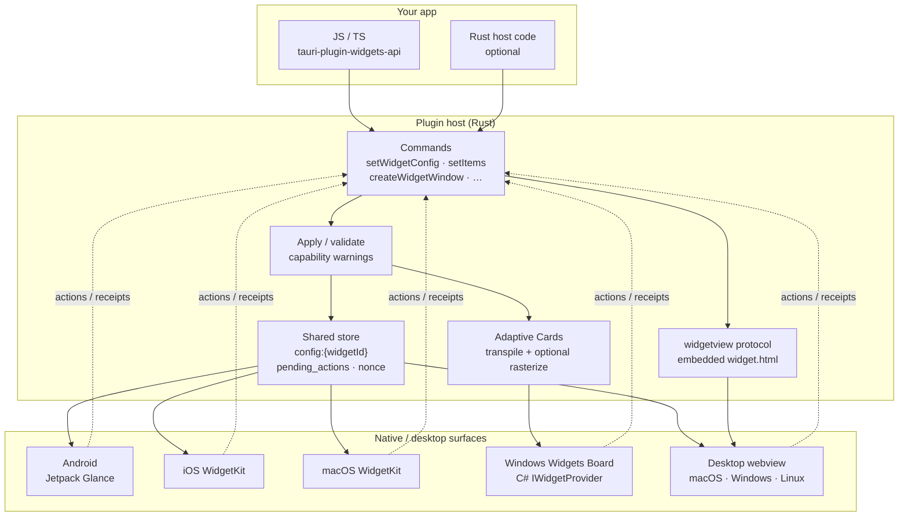
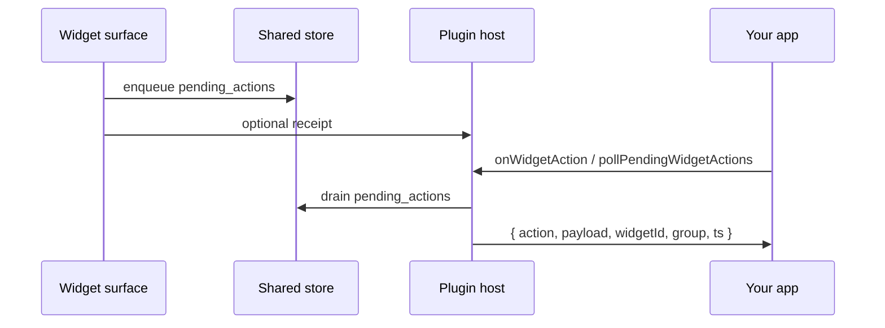

# Concepts

<div class="doc-illust">


</div>

## Architecture flowchart

End-to-end data path: one IR write on the host, five possible render surfaces.



**Write path:** `setWidgetConfig` → validate → write `config:{widgetId}` (+ Apple transport / Android prefs / desktop file) → reload or pin update → renderer paints IR.

**Desktop shortcut:** `createWidgetWindow` without `url` loads the embedded page over `widgetview`; that page calls `getWidgetConfig` itself — you do not copy `widget.html`.

**Windows Board:** same IR write also fills `ac:template:{widgetId}` / `ac:data:{widgetId}` for the MSIX provider.

**Actions (tap → app):**



Apple host writes use **one** configured transport — see [Transport](/guide/transport). Platform setup: [Choose a platform](/guide/setup/).

## Intermediate representation (IR)

The IR source of truth is Rust (`src/models.rs`). TypeScript types are generated (`pnpm codegen`). Every platform renderer consumes the same JSON tree.

A config holds up to three size families:

```ts
interface WidgetConfig {
  version?: number;
  small?: WidgetElement;
  medium?: WidgetElement;
  large?: WidgetElement;
}
```

## `group` and `widgetId`

- **`group`** — shared storage namespace (App Group on Apple, SharedPreferences name on Android, file namespace on desktop).
- **`widgetId`** — logical identity of one widget UI inside that group. Required on `setWidgetConfig` / `getWidgetConfig` / `startWidgetUpdater`.

Storage keys look like `config:{widgetId}`. Multiple widgets can share a group and show different configs.

**Platform gotchas:**

- **Apple:** `group` must equal `plugins.widgets.appGroup` and the Xcode App Group. Swift `TauriWidgetProvider(widgetId:)` defaults to `"default"` — keep it equal to the JS `widgetId`.
- **Android:** default store name is the app **package name** (not an arbitrary `group.com…` string) unless you set `tauri_widget_group` meta-data. See [Android setup](/guide/setup/android).
- **Desktop webview:** any stable string works for the embedded window; still set `plugins.widgets` when developing on a **macOS** host.

On Android, each home-screen instance maps to a logical `widgetId` (meta `widgetId:{appWidgetId}`). Call `setWidgetConfig` per id after pinning.

## Desktop renderer (`widget.html`)

On desktop, the default UI is **not** a file you add to the Vite/Webpack root. The plugin embeds `widget.html` in the Rust crate and serves it via a custom URI scheme when you call `createWidgetWindow` without `url`. Install the crate/JS package, push a config, open a window — nothing else to fetch. Optional custom pages and `tauri.conf.json` caveats: [Desktop webview](/guide/setup/desktop).

## Transport (Apple)

The host writes through **one** configured driver (`plugins.widgets.transport`). Wrong transport fails plugin init loudly — empty widgets from a silent fallback are not expected. Details: [Transport](/guide/transport).

## Diagnostics and receipts

Native renderers can report receipts. Use `getWidgetDiagnostics(group)` to inspect what the extension last rendered / skipped. Receipts feed diagnostics — they do not select transport.

## Capability warnings

When a config **changes**, the plugin logs degraded / unsupported capability warnings for the **current** platform only. The full matrix is in [Core vs extended](/guide/tiers).

## Breaking changes in 0.4

- `widgetId` required on config / updater / built-in window renderer
- Storage keys renamed: `config:{widgetId}`, `pending_actions`
- Action payload includes `widgetId` and `group`
- iOS `group` must start with `group.` (no silent rewrite)
