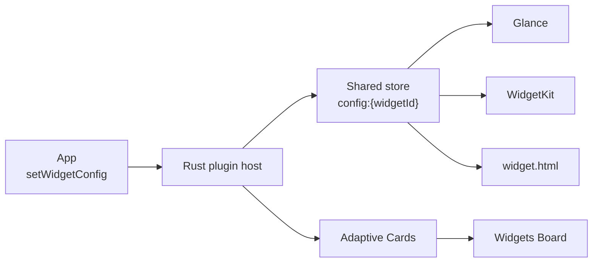

# Guide

**tauri-plugin-widgets** renders home-screen and desktop widgets from one declarative JSON config across Android, iOS, macOS, Windows, and Linux.

App code calls `setWidgetConfig` → plugin host writes shared storage → native renderers (Glance, WidgetKit, embedded desktop `widget.html`, Adaptive Cards) read and draw. On desktop you do not install `widget.html` yourself for the default path — see [Desktop webview](/guide/setup/desktop).

Full diagram + action sequence: [Concepts → Architecture flowchart](/guide/concepts#architecture-flowchart).

## What it is

- Shared **widget IR** (`WidgetConfig` / `WidgetElement`) defined in Rust, generated for TypeScript
- Platform backends that map that IR to Glance, SwiftUI, HTML, or Adaptive Cards
- Host APIs for config, key/value data, actions, diagnostics, desktop windows

## What it is not

- A visual designer
- A guarantee that every extended element looks identical everywhere — see [Core vs extended](/guide/tiers)

## Path

1. [Install](/guide/install)
2. [First widget](/guide/first-widget) (desktop)
3. [Concepts](/guide/concepts) · [Transport](/guide/transport)
4. [Platform setup](/guide/setup/) when you need a native surface
5. [Elements](/elements/) · [Showcase](/showcase)

Contributor docs: [Contributing](/contributing/).
