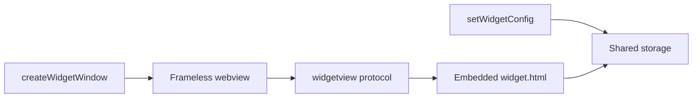

# Desktop webview

Desktop hosts show widgets as **frameless transparent webview windows**. The JSON config is drawn by a small HTML/JS renderer shipped **inside the Rust crate** — you do **not** copy or install a separate `widget.html` for the default path.

**Windows** also supports **Widgets Board** via Adaptive Cards (see [Windows setup](/guide/setup/windows)). **Linux** pins webview windows with X11 `_NET_WM_WINDOW_TYPE_DESKTOP` when the `linux` feature is on (Wayland: optional `layer-shell`).

## How it works

1. App code calls `setWidgetConfig(config, group, widgetId)` — the host writes IR JSON into shared storage.
2. `createWidgetWindow({ label, width, height, group, widgetId, size })` opens a frameless window.
3. With **no `url`**, the plugin loads the built-in page over a custom URI scheme (`widgetview://…` on macOS/Linux, `https://widgetview.localhost/…` on Windows) and passes `group`, `widgetId`, and `size` as query params.
4. That page is the repo’s `widget.html`, compiled into the plugin via `include_bytes!` at plugin init. It calls `getWidgetConfig` / listens for updates and paints the IR with vanilla HTML/CSS/SVG.

So after `cargo add` / `tauri add`, the renderer is already there. Nothing to download from GitHub or put under `public/`.



## Recommended: dynamic window (TypeScript)

```typescript
import { createWidgetWindow, closeWidgetWindow } from "tauri-plugin-widgets-api";

await createWidgetWindow({
  label: "weather",
  width: 280,
  height: 200,
  x: 80,
  y: 80,
  skipTaskbar: true,
  group: "group.com.example.myapp",
  widgetId: "weather",
  size: "small",
  // url omitted → built-in renderer
});

await closeWidgetWindow("weather");
```

`group`, `widgetId`, and `size` are required when `url` is omitted — they tell the embedded page which config to load.

Full walkthrough: [First widget](/guide/first-widget).

## Custom renderer (optional)

Only set `url` if you want **your own** frontend page instead of the built-in one:

```typescript
await createWidgetWindow({
  label: "weather",
  url: "/my-widget.html", // served from your app frontend
  width: 280,
  height: 200,
});
```

Then you own loading and painting. A reference implementation ships in the npm package as `widget.html` (same file as in the crate):

```bash
# inspect / fork as a starting point — not required for the default path
cp node_modules/tauri-plugin-widgets-api/widget.html src/my-widget.html
```

Or browse it on GitHub: [`widget.html`](https://github.com/s00d/tauri-plugin-widgets/blob/main/widget.html).

## Declarative windows in `tauri.conf.json`

Prefer `createWidgetWindow` for the built-in renderer: it wires the `widgetview` URL and query params correctly.

If you declare a window in config instead, **`"/widget.html"` is not provided by the plugin** — that path only works if **you** put a file in your frontend assets (see [Custom renderer](#custom-renderer-optional)). Example of a custom-asset window:

```json
{
  "app": {
    "windows": [
      { "label": "main", "title": "My App", "width": 800, "height": 600 },
      {
        "label": "desktop-widget",
        "url": "/my-widget.html",
        "width": 300,
        "height": 150,
        "decorations": false,
        "transparent": true,
        "alwaysOnBottom": true,
        "skipTaskbar": true,
        "visible": false,
        "resizable": false
      }
    ]
  }
}
```

## When it fails

- Call `createWidgetWindow(...)` without `url`, and pass `group` / `widgetId` / `size`.
- Do not expect `/widget.html` to exist unless you copied a custom page into the frontend.
- Allow the window label in capabilities (`widgets:default` / window permissions).
- On Linux, enable the `linux` feature for X11 DESKTOP pinning.
- On Windows Widgets Board, run `init-windows` and verify `ac:template:*` after `setWidgetConfig`.

More symptoms: [Troubleshooting index](/guide/troubleshooting).
